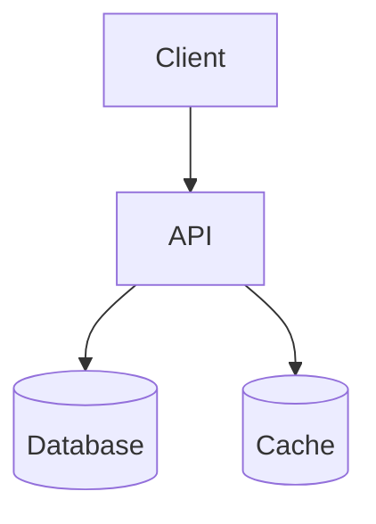
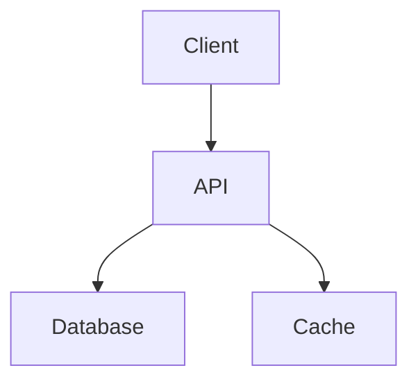
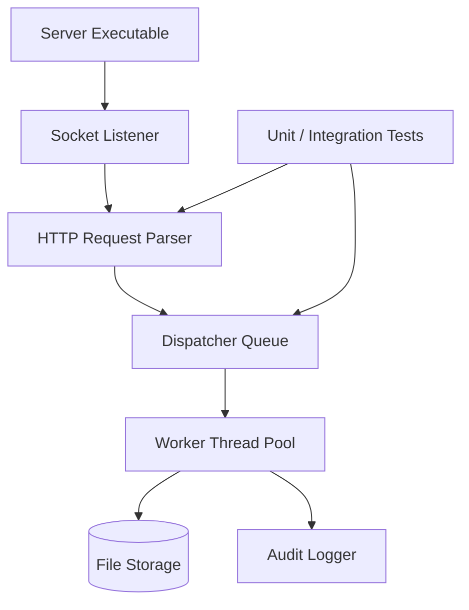
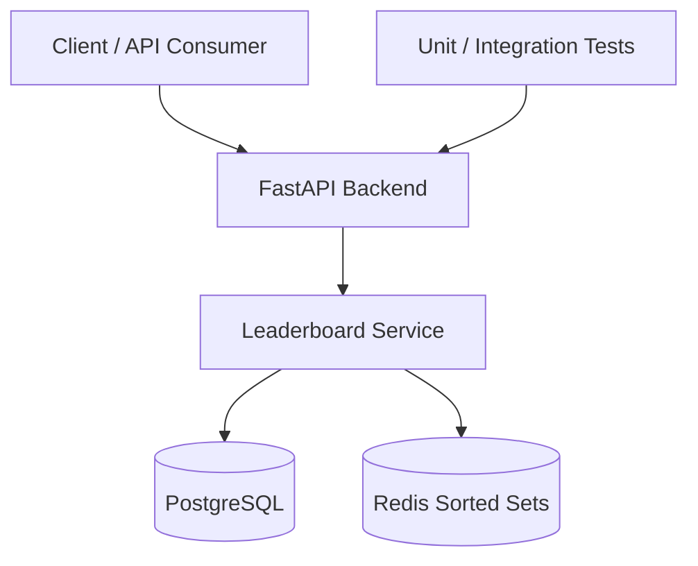

# Product Spec Sheet: Architecture Diagram Generator

## 1. Product Summary

**Product name:** Architecture Diagram Generator  
**Working CLI name:** `archgen`  
**Product type:** Developer tool / CLI utility  
**Primary output:** Mermaid architecture diagrams  
**Secondary outputs:** Markdown architecture docs, SVG diagrams, endpoint summaries

`archgen` is a command-line tool that scans a software project, detects major architectural components, and generates a Mermaid diagram that helps developers quickly visualize how the system is structured.

The initial version will focus on practical static heuristics rather than perfect program analysis. It will detect common project components such as API servers, databases, caches, Docker configuration, tests, REST endpoints, and C/C++ systems-programming structures such as source/header modules, Makefile or CMake targets, CLI binaries, socket layers, worker/thread-pool code, file I/O modules, and protocol-handling components.

## 2. Problem Statement

Developers often have old projects, school projects, portfolio projects, and work-in-progress repositories that are hard to understand at a glance. Architecture diagrams are useful, but creating and maintaining them manually takes time. As projects evolve, diagrams become outdated quickly.

This tool solves that problem by automatically scanning a codebase and producing a useful first-draft architecture diagram and documentation summary.

## 3. Target Users

### Primary user

**Early-career software developer / CS new grad**

Needs:

- Quickly understand old projects
- Visualize C/C++ systems projects and Python backend projects
- Improve README documentation
- Prepare portfolio repositories for recruiters
- Explain system design decisions in interviews
- Generate visual architecture diagrams without manually drawing everything

### Secondary users

**Developers joining an unfamiliar codebase**

Needs:

- Understand high-level project structure
- Identify API, database, cache, worker, and external service layers
- Find important files and routes quickly

**Open-source maintainers**

Needs:

- Generate architecture documentation for contributors
- Keep basic architecture diagrams close to the codebase

## 4. Goals

The product should:

1. Scan a local repository.
2. Detect major architectural components using filesystem patterns and code heuristics.
3. Generate a Mermaid diagram.
4. Optionally generate a Markdown architecture document.
5. Be easy to run from the command line.
6. Be extensible through detector modules.
7. Allow manual overrides through a config file.
8. Produce useful output even when detection is imperfect.

## 5. Non-Goals for MVP

The MVP will not attempt to:

1. Fully understand arbitrary code execution paths.
2. Build a complete call graph.
3. Perform deep type analysis.
4. Perfectly detect every microservice relationship.
5. Automatically infer business logic.
6. Replace human-written architecture documentation.
7. Support every programming language immediately.
8. Require a web UI.

The MVP should prioritize usefulness, explainability, and clean output over perfect accuracy.

## 6. MVP Scope

### Supported project types for MVP

The first polished version should focus on:

- C systems projects
- C++ systems projects where detection can reuse C/C++ patterns
- Python backend projects
- FastAPI projects
- Flask projects
- PostgreSQL detection
- SQLite detection
- Redis detection
- Docker / Docker Compose detection
- Makefile detection
- CMake detection
- CLI binary / executable target detection
- Source/header module detection
- Basic socket/thread/file I/O detection for C/C++
- REST endpoint extraction for supported Python web frameworks

### MVP inputs

A local project path:

```bash
archgen ./my-project
```

Optional flags:

```bash
archgen ./my-project --output docs/architecture.mmd
archgen ./my-project --markdown
archgen ./my-project --include-endpoints
archgen ./my-project --config archgen.toml
```

### MVP outputs

At minimum:

- `docs/architecture.mmd`

Optional:

- `docs/architecture.md`
- `docs/endpoints.md`

## 7. Core User Stories

### Story 1: Generate a basic architecture diagram

As a developer, I want to run a CLI command on a repository so that I can quickly generate a Mermaid diagram of the project architecture.

Example:

```bash
archgen .
```

Expected output:

```text
Generated docs/architecture.mmd
Detected: API, Database, Cache, Tests
```

### Story 2: Generate architecture documentation

As a developer, I want the tool to create a Markdown architecture document so that I can add it to my project documentation or README.

Example:

```bash
archgen . --markdown
```

Expected output:

```text
Generated docs/architecture.md
```

### Story 3: Detect REST endpoints

As a developer, I want the tool to detect API routes so that I can document the backend surface area automatically.

Example detections:

```python
@app.get("/scores")
@router.post("/games/{game_id}/scores")
```

Expected endpoint output:

```text
GET /scores
POST /games/{game_id}/scores
```

### Story 4: Visualize a C systems project

As a developer, I want the tool to scan a C project so that I can see major modules, executable targets, and systems-level relationships such as network I/O, worker threads, queues, file storage, and shared utilities.

Example detections:

```c
#include "queue.h"
#include "http.h"
#include "threadpool.h"
pthread_create(...)
accept(...)
read(...)
write(...)
```

Expected architecture output:

```text
Main Server Binary
├── Socket / Listener Layer
├── Request Parser
├── Dispatcher Queue
├── Worker Thread Pool
└── File Store
```

### Story 5: Customize generated diagrams

As a developer, I want to provide manual overrides so that I can fix or improve the generated diagram when static detection is incomplete.

Example config:

```toml
[project]
name = "Leaderboard API"

[manual_nodes]
worker = "Background Worker"

[aliases]
db = "PostgreSQL"
cache = "Redis Cache"
```

## 8. Functional Requirements

### 8.1 Repository scanning

The tool must recursively scan a target directory.

#### Must include

- `.c`
- `.h`
- `.cpp`
- `.cc`
- `.cxx`
- `.hpp`
- `.hh`
- `.hxx`
- `.py`
- `.json`
- `.toml`
- `.yaml`
- `.yml`
- `.env.example`
- `Dockerfile`
- `docker-compose.yml`
- `Makefile`
- `CMakeLists.txt`
- `compile_commands.json`

#### Must ignore by default

- `.git/`
- `.venv/`
- `venv/`
- `__pycache__/`
- `.pytest_cache/`
- `dist/`
- `build/`
- `coverage/`

### 8.2 Component detection

The tool must detect high-level components.

#### C/C++ project detection

Detect C/C++ projects through:

- `.c`, `.h`, `.cpp`, `.hpp`, `.cc`, `.hh`, `.cxx`, `.hxx` files
- `Makefile`
- `CMakeLists.txt`
- `compile_commands.json`
- `src/`, `include/`, `lib/`, `tests/` directories

Detected nodes may include:

```text
C Application
C++ Application
Library Module
Executable Target
Header Interface
Shared Utility Module
```

#### C/C++ module and dependency detection

Infer module relationships through:

- Local `#include "..."` statements
- Source/header filename pairs such as `queue.c` and `queue.h`
- Folder boundaries such as `src/net/`, `src/http/`, `src/storage/`
- Makefile or CMake target definitions
- Shared utility files such as `utils.c`, `log.c`, `error.c`

Detected relationships may include:

```text
main.c --> server module
server module --> queue module
server module --> thread pool module
http parser --> request handler
```

#### C/C++ systems-pattern detection

Detect systems-programming concepts through common APIs and naming patterns:

- Sockets: `socket`, `bind`, `listen`, `accept`, `connect`, `send`, `recv`
- Threads: `pthread_create`, `pthread_join`, `pthread_mutex`, `pthread_cond`
- Synchronization: `sem_wait`, `sem_post`, mutexes, condition variables, locks
- File I/O: `open`, `read`, `write`, `fopen`, `fread`, `fwrite`
- Memory management: `malloc`, `calloc`, `realloc`, `free`
- Processes: `fork`, `exec`, `wait`, `pipe`
- Compression/encoding style modules: `encode`, `decode`, `compress`, `decompress`, `bitreader`, `bitwriter`

Detected nodes may include:

```text
Socket Layer
Worker Thread Pool
Shared Queue
Synchronization Layer
File Storage
Process Manager
Encoder
Decoder
Bit I/O
```

#### API detection

Detect API/backend components through patterns such as:

- `FastAPI(`
- `Flask(`
- `APIRouter(`
- `app.get(`
- `app.post(`
- `router.get(`
- `router.post(`

Detected node:

```text
API
```

#### Database detection

Detect database components through:

- `sqlalchemy`
- `psycopg`
- `asyncpg`
- `sqlite3`
- `models.py`
- `migrations/`
- `alembic/`

Detected nodes may include:

```text
Database
PostgreSQL
SQLite
```

#### Cache detection

Detect cache components through:

- `redis`
- `aioredis`
- `Redis.from_url`

Detected node:

```text
Cache
```

#### Docker detection

Detect deployment/containerization components through:

- `Dockerfile`
- `docker-compose.yml`
- `compose.yaml`

Detected nodes may include:

```text
Docker
Docker Compose
Service Container
```

#### Test detection

Detect tests through:

- `tests/`
- `test_*.py`
- `*_test.py`
- `pytest`
- `unittest`

Detected node:

```text
Tests
```

#### External API detection

Detect external API usage through:

- `requests.get`
- `requests.post`
- `httpx.get`
- `httpx.post`
- Environment variables ending in `_API_URL`, `_BASE_URL`, `_TOKEN`, `_KEY`

Detected node:

```text
External API
```

### 8.3 Endpoint extraction

For supported frameworks, the tool should extract route information.

#### FastAPI examples

```python
@app.get("/health")
@app.post("/scores")
@router.get("/games/{game_id}/leaderboard")
```

Extracted endpoints:

```text
GET /health
POST /scores
GET /games/{game_id}/leaderboard
```

#### Flask examples

```python
@app.route("/health", methods=["GET"])
@app.route("/scores", methods=["POST"])
```

Extracted endpoints:

```text
GET /health
POST /scores
```

### 8.4 Graph generation

The tool must convert detected components into a graph model.

#### Node model

```python
@dataclass
class Node:
    id: str
    label: str
    kind: str
    source_files: list[str]
```

#### Edge model

```python
@dataclass
class Edge:
    source: str
    target: str
    label: str | None = None
    confidence: float = 1.0
```

#### Graph model

```python
@dataclass
class ArchitectureGraph:
    nodes: list[Node]
    edges: list[Edge]
    warnings: list[str]
```

### 8.5 Mermaid rendering

The tool must generate valid Mermaid flowchart syntax.

Basic example:



#### Styling goal

Use Mermaid node shapes to improve readability:

```text
API/service: rectangle
Database: cylinder-style Mermaid node
Cache: cylinder-style Mermaid node
External API: cloud-like label or normal rectangle
Tests: rectangle
```

### 8.6 Markdown documentation rendering

The tool should optionally generate a Markdown file.

Example structure:

````markdown
# Architecture Overview

## Summary

This project appears to contain a FastAPI backend using PostgreSQL and Redis.

## Diagram



## Detected Components

| Component | Type | Evidence |
|---|---|---|
| FastAPI Backend | API | app/main.py |
| PostgreSQL | Database | app/db.py |
| Redis | Cache | app/cache.py |

## Detected Endpoints

| Method | Path | Source File |
|---|---|---|
| GET | /health | app/main.py |
| POST | /scores | app/routes/scores.py |

## Assumptions and Warnings

- This diagram was generated using static heuristics.
- Runtime-only dependencies may not be detected.
- Manual review is recommended.
````

---

## 9. CLI Specification

### 9.1 Basic command

```bash
archgen PATH
```

Example:

```bash
archgen .
```

Default behavior:

- Scan current repo
- Generate `docs/architecture.mmd`
- Print detected components

### 9.2 Options

```bash
archgen . --output docs/architecture.mmd
```

Sets Mermaid output path.

```bash
archgen . --markdown
```

Also generates Markdown architecture documentation.

```bash
archgen . --include-endpoints
```

Includes route-level endpoint information.

```bash
archgen . --config archgen.toml
```

Uses project-specific config overrides.

```bash
archgen . --dry-run
```

Prints detected architecture without writing files.

```bash
archgen . --verbose
```

Prints detailed detection evidence.

## 10. Suggested Internal Architecture

```text
archgen/
├── archgen/
│   ├── __init__.py
│   ├── cli.py
│   ├── scanner.py
│   ├── file_index.py
│   ├── graph.py
│   ├── config.py
│   ├── detectors/
│   │   ├── __init__.py
│   │   ├── base.py
│   │   ├── python_detector.py
│   │   ├── c_detector.py
│   │   ├── cpp_detector.py
│   │   ├── build_detector.py
│   │   ├── systems_detector.py
│   │   ├── database_detector.py
│   │   ├── cache_detector.py
│   │   ├── docker_detector.py
│   │   ├── test_detector.py
│   │   └── endpoint_detector.py
│   ├── renderers/
│   │   ├── __init__.py
│   │   ├── mermaid.py
│   │   └── markdown.py
│   └── utils/
│       ├── paths.py
│       └── text.py
├── tests/
├── examples/
├── pyproject.toml
└── README.md
```

## 11. Data Flow

```text
User runs CLI
    ↓
Parse command-line arguments
    ↓
Load optional config file
    ↓
Scan repository files
    ↓
Run detectors
    ↓
Collect detected components, endpoints, and evidence
    ↓
Build architecture graph
    ↓
Render Mermaid diagram
    ↓
Optionally render Markdown documentation
    ↓
Write output files
```

## 12. Detection Confidence

Each detected component should optionally include a confidence score.

Examples:

| Detection | Confidence |
|---|---:|
| `FastAPI(` found in `main.py` | 0.95 |
| `redis` dependency found in requirements | 0.85 |
| `.env.example` contains `DATABASE_URL` | 0.75 |
| Folder named `services/` exists | 0.50 |

This allows the generated documentation to say:

```text
Detected Redis cache with medium confidence.
```

## 13. Config File Specification

Default config filename:

```text
archgen.toml
```

Example:

```toml
[project]
name = "Leaderboard API"

[output]
mermaid = "docs/architecture.mmd"
markdown = "docs/architecture.md"

[ignore]
paths = [".venv", "dist", "build", "coverage"]

[manual_nodes]
worker = "Background Worker"
audit = "Audit Logger"

[manual_edges]
edges = [
    ["API", "PostgreSQL"],
    ["API", "Redis"],
    ["Worker", "Audit Logger"]
]

[aliases]
postgres = "PostgreSQL"
redis = "Redis Cache"
```

## 14. Example Output for a C Multithreaded HTTP Server Project

### Mermaid output



### Markdown summary output

```markdown
# Architecture Overview

This project appears to be a C network server using sockets, pthread-based worker threads, a shared queue, file I/O, and audit logging.

## Detected Components

| Component | Type | Evidence |
|---|---|---|
| Server Executable | Binary Target | Makefile, src/main.c |
| Socket Listener | Network Layer | src/server.c |
| HTTP Request Parser | Protocol Layer | src/http.c, include/http.h |
| Dispatcher Queue | Concurrency/Data Structure | src/queue.c, include/queue.h |
| Worker Thread Pool | Concurrency | src/threadpool.c |
| File Storage | File I/O | src/handler.c |
| Audit Logger | Logging | src/audit.c |

## Assumptions

- Module relationships were inferred from local includes and file naming.
- Runtime control flow may differ from the generated diagram.
```

## 15. Example Output for a FastAPI Leaderboard Project

### Mermaid output



### Markdown summary output

```markdown
# Architecture Overview

This project appears to be a FastAPI backend using PostgreSQL for persistent storage and Redis for leaderboard ranking/cache operations.

## Detected Components

| Component | Type | Evidence |
|---|---|---|
| FastAPI Backend | API | app/main.py |
| PostgreSQL | Database | app/db.py, alembic/ |
| Redis | Cache | app/ranking.py |
| Tests | Test Suite | tests/ |

## Detected Endpoints

| Method | Path |
|---|---|
| POST | /scores |
| GET | /games/{game_id}/leaderboard |
| GET | /games/{game_id}/users/{user_id}/context |
```

## 15. Testing Strategy

### 15.1 Unit tests

Test individual detectors.

Examples:

- C detector identifies `.c` and `.h` projects.
- Include detector maps local `#include "..."` dependencies.
- Build detector identifies Makefile and CMake targets.
- Systems detector identifies sockets, pthreads, queues, synchronization, and file I/O patterns.
- FastAPI detector finds `FastAPI(`.
- Endpoint detector extracts `GET /health`.
- Redis detector finds Redis usage.
- Database detector finds SQLAlchemy usage.
- Scanner ignores `.venv` and build output directories.
- Mermaid renderer outputs valid node and edge lines.

### 15.2 Fixture-based tests

Create small fake projects inside `tests/fixtures/`:

```text
tests/fixtures/
├── c_http_server/
├── c_cli_encoder_decoder/
├── cpp_cmake_project/
├── fastapi_postgres_redis/
├── flask_sqlite/
└── mixed_backend_systems/
```

Each fixture should have expected detected components.

### 15.3 Snapshot tests

For generated Mermaid output, compare against expected `.mmd` snapshots.

Example:

```text
tests/snapshots/fastapi_postgres_redis.mmd
```

## 16. Milestones

### Milestone 1: Scanner and summary output

**Goal:** Scan a repo and print detected languages/files.

Deliverables:

- CLI entry point
- Recursive scanner
- Ignore rules
- Summary output

Example output:

```text
Scanned 42 files.
Detected languages:
- Python: 21 files
- YAML: 2 files
```

### Milestone 2: Basic component detection

**Goal:** Detect major components, prioritizing C/C++ and Python backend projects.

Deliverables:

- C/C++ project detector
- Source/header module detector
- Makefile and CMake detector
- Systems-pattern detector for sockets, threads, synchronization, file I/O, and CLI binaries
- Python API detector
- Database detector
- Redis/cache detector
- Docker detector
- Test detector

Example output:

```text
Detected components:
- API: FastAPI
- Database: PostgreSQL
- Cache: Redis
- Tests: pytest
```

### Milestone 3: Mermaid graph output

**Goal:** Generate a useful Mermaid diagram.

Deliverables:

- Graph model
- Mermaid renderer
- Output file writing

Example command:

```bash
archgen . --output docs/architecture.mmd
```

### Milestone 4: C/C++ architecture extraction

**Goal:** Generate useful diagrams for C/C++ systems projects.

Deliverables:

- Include graph extraction from local headers
- Makefile/CMake target extraction
- Module grouping by folder and filename
- Detection for socket servers, worker threads, queues, locks, file I/O, and encode/decode pipelines
- Mermaid diagrams for C/C++ project fixtures

### Milestone 5: Endpoint extraction

**Goal:** Detect common REST routes for supported Python web projects.

Deliverables:

- FastAPI endpoint extraction
- Flask endpoint extraction
- Optional endpoint table in Markdown

### Milestone 5: Markdown architecture doc

**Goal:** Generate an architecture overview document.

Deliverables:

- Markdown renderer
- Detected component table
- Endpoint table
- Assumptions/warnings section

### Milestone 6: Config overrides

**Goal:** Let users customize imperfect generated diagrams.

Deliverables:

- `archgen.toml` support
- Manual nodes
- Manual edges
- Aliases
- Ignore path overrides

## 17. MVP Acceptance Criteria

The MVP is complete when:

1. A user can install/run the CLI locally.
2. The CLI can scan a C project with source/header files.
3. The CLI can detect Makefile or CMake build structure when present.
4. The CLI can detect common C systems patterns such as sockets, pthreads, queues, synchronization, file I/O, and CLI binaries.
5. The CLI can scan a Python FastAPI project.
6. The CLI detects API, database, cache, tests, and Docker when present.
7. The CLI generates a valid Mermaid `.mmd` file.
8. The generated Mermaid diagram renders successfully in Mermaid-compatible viewers.
9. The CLI can optionally generate a Markdown architecture document.
10. The tool includes tests for scanner, detectors, graph generation, and Mermaid rendering.
11. The README explains installation, usage, examples, and limitations.

## 18. README Requirements

The project README should include:

1. Project description
2. Example input repository
3. Example Mermaid output
4. Installation instructions
5. CLI usage examples
6. Supported detections
7. Limitations
8. Roadmap
9. Screenshots or rendered diagrams

Suggested README tagline:

```text
A lightweight CLI tool that scans a codebase and generates Mermaid architecture diagrams for documentation, onboarding, and portfolio projects.
```

## 19. Risks and Mitigations

### Risk: Static detection is inaccurate

Mitigation:

- Show evidence for each detection.
- Include assumptions/warnings section.
- Support manual config overrides.

### Risk: Scope becomes too large

Mitigation:

- Focus MVP on C/C++ systems projects and Python backend projects.
- Avoid deep AST analysis in v1.
- Use practical heuristics first: filenames, folders, includes, build files, and known API calls.

### Risk: Generated diagrams become cluttered

Mitigation:

- Default to high-level components only.
- Add `--include-endpoints` as an optional flag.
- Add future `--detail-level` option.

### Risk: Mermaid output has invalid syntax

Mitigation:

- Sanitize node IDs.
- Escape quotes in labels.
- Add snapshot tests.
- Test output in Mermaid Live Editor or Mermaid CLI.

## 20. Future Enhancements

Potential stretch features:

1. SVG export using Mermaid CLI.
2. HTML report generation.
3. GitHub Actions integration.
4. Pull request comment with updated architecture diagram.
5. Tree-sitter-based parsing.
6. Dependency graph visualization.
7. Import graph visualization.
8. Service-level diagram generation for monorepos.
9. OpenAPI schema detection.
10. Docker Compose service graph detection.
11. Database table/entity diagram generation.
12. Interactive web UI.
13. VS Code extension.
14. AI-assisted architecture explanation.

## 21. Recommended First Implementation Path

Start with the simplest useful version:

1. Build the scanner.
2. Print a file/language summary.
3. Add C/C++ file detection.
4. Add local include detection for `.c`/`.h` and `.cpp`/`.hpp` files.
5. Add Makefile and CMake detection.
6. Add systems-pattern detection for sockets, pthreads, queues, synchronization, file I/O, and CLI binaries.
7. Build a graph model.
8. Render Mermaid.
9. Test it on one of your own C repositories.
10. Add Markdown output.
11. Add Python/FastAPI detection.
12. Add PostgreSQL/SQLite detection.
13. Add Redis detection.
14. Add REST endpoint extraction.

The first public version should be useful for C/C++ systems projects and Python backend projects before broader language support is considered.

## 22. Definition of Done for Version 1

Version 1 is ready to publish when it can run successfully on at least three real repositories and produce diagrams that are useful enough to include in project documentation.

Suggested test repositories:

1. A C systems project such as a multithreaded HTTP server
2. A C CLI project such as compression/decompression, cryptography, or encoding/decoding
3. A Python FastAPI backend project
4. An older school/project repository with less polished structure

For each repository, the tool should generate:

- `docs/architecture.mmd`
- `docs/architecture.md`

The generated output should require only minor human cleanup.
